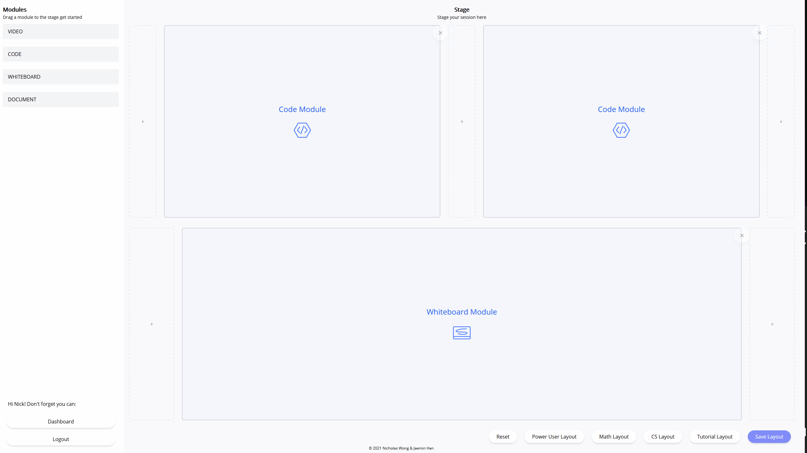
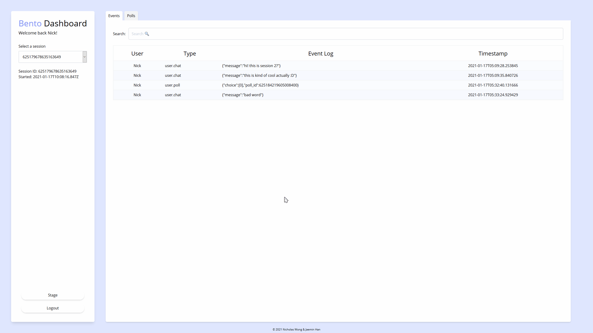

# 🍱 Bento
Our HackTheNorth2020++ submission, but maybe it's something more 👀.

## Purpose
We're students; we know the struggle of online learning.
No sugar-coating - it's hell 🔥.
That doesn't mean it can't be made easier though.

Enter, **Bento**.

Our sweet, modular interface builder and data-driven dashboard puts power in the hands of instructors.

 

## Customize Your Environment

Organize like you would your classroom.
Take control of our powerful module system to build the perfect user interface.
 
 
## Analyze The Metrics

Catch all the metrics.
From polls to *everything* that happened during the session, you can measure student engagement, whether to gauge your teaching style, trace inappropriate conduct, or gather results.
The full dashboard is nothing short of amazing.

Wait no longer, head on to [bentobox.tech](https://bentobox.tech) to get started!